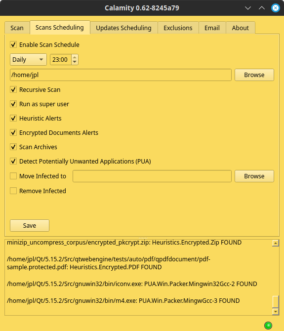
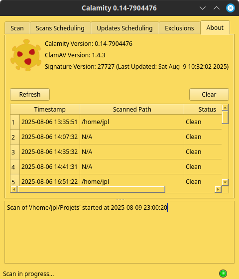

# Calamity


Calamity is a graphical user interface (GUI) for the ClamAV antivirus engine, written in C++ with the Qt framework. It provides a simple and intuitive way to scan files and directories for malware.

## Features

*   Scan individual files or entire directories.
*   Schedule scans and updates.
*   Display real-time scan progress and results.
*   Shows ClamAV engine and virus database versions.
*   Cancel ongoing scans.
*   Simple, clean, and intuitive user interface.
*   Drag-and-drop files/folders onto the output log to initiate a scan.

## Screenshots




## Prerequisites

Before you begin, ensure you have met the following requirements:

*   A C++ compiler (e.g., GCC, Clang, MSVC)
*   Qt Framework (version 5.12 or higher)
*   ClamAV (must be installed and `clamscan` must be in your system's PATH)

## Building from Source

1.  **Clone the repository:**
    ```bash
    git clone https://github.com/jplozf/calamity.git
    cd calamity
    ```

2.  **Generate the Makefile:**
    ```bash
    qmake
    ```

3.  **Compile the project:**
    ```bash
    make
    ```
    On Windows, you might use `nmake` or `mingw32-make` depending on your compiler.

4.  **Run the application:**
    The executable will be located in the build directory.
    ```bash
    ./calamity
    ```

## Usage

1.  Launch the Calamity application.
2.  In the "Scan" tab, click the "Browse" button to select what you want to scan, and then click "Scan".
3.  Alternatively, drag and drop files or folders directly onto the output log panel to start a scan.
4.  The scan will start, and the progress will be displayed in the output window.
5.  If any threats are found, they will be listed in the results table.
6.  You can stop the scan at any time by clicking the "Stop" button.
7.  You can also schedule scans, updates and add exclusions.
8.  The "About" tab displays some useful informations, and previous reports can be examined by double-clicking the corresponding line.

## TODO

*   Multi paths scans.
*   Improve audible alerts.
*   Improve scheduling.
*   Report by mail.

## License

This project is licensed under the GNU General Public License - see the [LICENSE.md](LICENSE.md) file for details.
