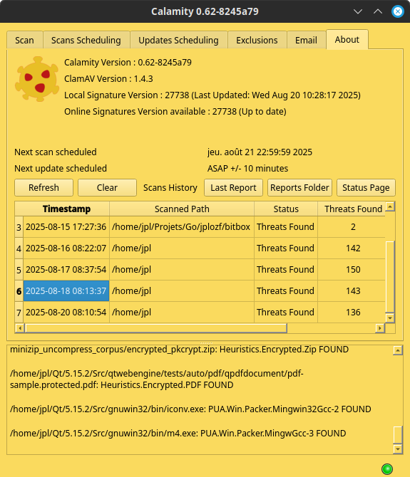

# Calamity


Calamity is a graphical user interface (GUI) for the ClamAV antivirus engine, written in C++ with the Qt framework. It provides a simple and intuitive way to scan files and directories for malware.

## Features

*   Scan individual files or entire directories.
*   Schedule scans and updates.
*   Display real-time scan progress and results.
*   Shows ClamAV engine and virus database versions.
*   Cancel ongoing scans.
*   Simple, clean, and intuitive user interface.
*   Drag-and-drop files/folders onto the output log to initiate a scan.

## Screenshots




## Prerequisites

Before you begin, ensure you have met the following requirements:

*   A C++ compiler (e.g., GCC, Clang, MSVC)
*   Qt Framework (version 5.12 or higher)
*   ClamAV (must be installed and `clamscan` must be in your system's PATH)

## Building from Source

1.  **Clone the repository:**
    ```bash
    git clone https://github.com/jplozf/calamity.git
    cd calamity
    ```

2.  **Generate the Makefile:**
    ```bash
    qmake
    ```

3.  **Compile the project:**
    ```bash
    make
    ```
    On Windows, you might use `nmake` or `mingw32-make` depending on your compiler.

4.  **Run the application:**
    The executable will be located in the build directory.
    ```bash
    ./calamity
    ```

## Usage

1.  Launch the Calamity application.
2.  In the "Scan" tab, click the "Browse" button to select what you want to scan, and then click "Scan".
3.  Alternatively, drag and drop files or folders directly onto the output log panel to start a scan.
4.  The scan will start, and the progress will be displayed in the output window.
5.  If any threats are found, they will be listed in the results table.
6.  You can stop the scan at any time by clicking the "Stop" button.
7.  You can also schedule scans, updates and add exclusions.
8.  The "About" tab displays some useful informations, and previous reports can be examined by double-clicking the corresponding line.

## Notes

The application use IPC Shared Memory Segment to prevent to be launched more than once at a time;
If it crashed and can't be relaunched, maybe you'll have to unlock the IPC Shared Memory Segment.

You first have to list all the IPC resources :
```bash
lsipc -m
```
Find the ID for the one which have a KEY with value equals to 0x512dd0f7 :
```bash
KEY        ID         PERMS OWNER SIZE NATTCH STATUS  CTIME    CPID    LPID COMMAND
0x00000000 819200 rw----rw-   jpl 7,5M      2 dest    08:12  724027    2585 /opt/Tabby/tabby --type=gpu-process --no-sandbox --crash
0x00000000 819201 rw----rw-   jpl 7,5M      2 dest    08:12  724027    2585 /opt/Tabby/tabby --type=gpu-process --no-sandbox --crash
0x00000000 950276 rw-------   jpl  36K      2 dest    10:46    5878    2585 /opt/jdk-17/bin/java -server --add-exports=java.desktop/
0x00000000 7      rw-------   jpl 256M      2 dest   août09    4751    2585 /usr/bin/csd-background
0x00000000 10     rw-------   jpl 512K      2 dest   août09    5061    2585 /usr/bin/python3 -sP /usr/bin/ulauncher --hide-window --
0x00000000 917517 rw-------   jpl 512K      2 dest    10:29    5066    2585 /usr/bin/nemo-desktop
0x00000000 98323  rw-------   jpl 512K      2 dest   août09    5347    2585 /usr/libexec/xdg-desktop-portal-gtk
0x00000000 23     rw-------   jpl 512K      2 dest   août09    5036    2585 /usr/libexec/xapps/xapp-sn-watcher
0x00000000 32797  rw-------   jpl   4M      2 dest   août09    6097 1254623 nemo
0x00000000 36     rw-------   jpl 512K      2 dest   août09    6097 1254623 nemo
0x00000000 983080 rw-------   jpl 512K      2 dest    13:07    4905    2585 cinnamon --replace
0x512dd0f7 983084 rw-------   jpl   1B      1         13:08 2569350 2598695 /home/jpl/Projets/Qt/calamity/build/Desktop_Qt_5_15_2_GC
0x00000000 720950 rw-------   jpl 512K      2 dest   août09 1310710    2585 /usr/bin/galculator
```
And then, you'll have to remove this IPC resource providing this ID :
```bash
ipcrm -m 983084
```

## TODO

*   Improve multi paths scans.
*   Add audible alerts.
*   Improve scheduling.
*   Finalize report by mail.

## License

This project is licensed under the GNU General Public License - see the [LICENSE.md](LICENSE.md) file for details.
